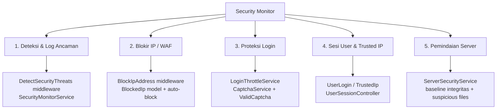
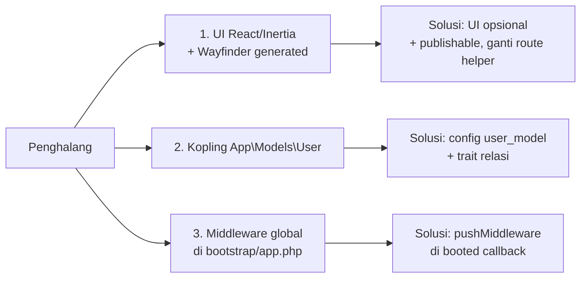
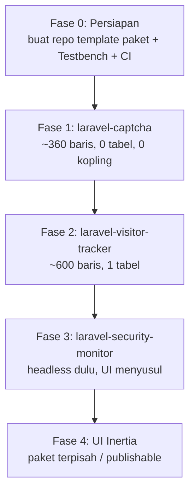

# Rencana Publikasi Paket Laravel ke Packagist

> Dokumen ini adalah rekap analisis repo **kominfo-superapp-api** untuk menilai modul mana yang
> layak diekstraksi menjadi paket Composer dan diterbitkan di [Packagist](https://packagist.org/).
>
> Disusun: 2026-10-01 · Basis kode: Laravel 13 + Inertia v3 + React 19 + Pest 4

---

## Daftar Isi

1. [Ringkasan Eksekutif](#1-ringkasan-eksekutif)
2. [Status Repo Saat Ini](#2-status-repo-saat-ini)
3. [Inventaris Modul Kandidat](#3-inventaris-modul-kandidat)
4. [Inventaris File per Modul](#4-inventaris-file-per-modul)
5. [Analisis Kopling](#5-analisis-kopling)
6. [Blueprint Struktur Paket](#6-blueprint-struktur-paket)
7. [Contoh ServiceProvider](#7-contoh-serviceprovider)
8. [Checklist Terbit ke Packagist](#8-checklist-terbit-ke-packagist)
9. [Gotcha Khusus Repo Ini](#9-gotcha-khusus-repo-ini)
10. [Roadmap Bertahap](#10-roadmap-bertahap)
11. [Lampiran: Variabel Environment](#11-lampiran-variabel-environment)

---

## 1. Ringkasan Eksekutif

Repo ini adalah **aplikasi** (`"type": "project"`, nama `laravel/react-starter-kit`), bukan paket.
Namun di dalamnya terdapat beberapa modul yang **berdiri sendiri** dan layak dipublikasikan.

**Kesimpulan utama:**

| Prioritas | Modul                      | Alasan                                                                                                                                                      |
| --------- | -------------------------- | ----------------------------------------------------------------------------------------------------------------------------------------------------------- |
| 🥇 **1**  | `laravel-captcha`          | Paling mandiri (~360 baris), tanpa kopling model/tabel. Titik awal terbaik untuk memvalidasi pipeline Packagist + Testbench + CI.                           |
| 🥈 **2**  | `laravel-security-monitor` | Fitur paling kaya (~7.000 baris) + **111 test** sebagai jaring pengaman. Nilai jual tinggi. Perlu kerja ekstra untuk melepas kopling `User` dan UI Inertia. |
| 🥉 **3**  | `laravel-visitor-tracker`  | Kecil (~600 baris) dan kopling rendah. Cocok sebagai paket pendamping.                                                                                      |
| —         | `laravel-region-api`       | Terlalu terikat konvensi tabel legacy `cndk1a_wilayah_*` dan skema wilayah Indonesia. Sebaiknya tetap internal.                                             |

**Rekomendasi strategi:** rilis **backend-first (headless)**. Kirim service, middleware, command,
migrasi, dan config sebagai paket. UI React/Inertia dijadikan **opsional & publishable**, bukan
bagian wajib paket.

> ⚠️ **Catatan lisensi:** repo ini milik Pribadi. Sebelum dipublikasikan sebagai
> MIT/Apache-2.0 di Packagist, pastikan ada izin tertulis dari pemilik produk.

---

## 2. Status Repo Saat Ini

| Aspek           | Nilai                                                   |
| --------------- | ------------------------------------------------------- |
| Nama composer   | `laravel/react-starter-kit`                             |
| Tipe            | `project` (bukan `library`)                             |
| PHP             | `^8.3`                                                  |
| Framework       | `laravel/framework ^13.0`                               |
| Frontend        | Inertia v3 + React 19 + Tailwind v4 + shadcn/ui (Radix) |
| Testing         | Pest 4 + `pest-plugin-laravel`                          |
| Route/action TS | Wayfinder (generated, **gitignored**)                   |
| Autoload        | `App\` → `app/`                                         |

**Konsekuensi:** seluruh namespace masih `App\`, tidak ada `composer.json` per-modul, tidak ada
`orchestra/testbench`, dan test bergantung pada `tests/Pest.php` milik aplikasi. Semua ini harus
dibuat ulang saat ekstraksi.

---

## 3. Inventaris Modul Kandidat

### 3.1 Security Monitor / WAF — kandidat utama

Gabungan **5 sub-fitur** yang sebenarnya bisa dipisah:



| Item              | Jumlah                                                             |
| ----------------- | ------------------------------------------------------------------ |
| File PHP backend  | ~24                                                                |
| Baris PHP backend | **± 6.800**                                                        |
| Migrasi           | 6                                                                  |
| Test Pest         | **111 test** dalam 11 file                                         |
| Halaman React     | 12 file `.tsx`                                                     |
| Config            | `config/security.php` (593 baris), `config/captcha.php` (57 baris) |
| Env var           | 29 (`SECURITY_*`) + 5 (`CAPTCHA_*`)                                |

### 3.2 Perbandingan Kandidat

| Aspek               | Security Monitor | Visitor Tracker | Captcha           |
| ------------------- | ---------------- | --------------- | ----------------- |
| Baris PHP           | ~6.800           | ~600            | ~360              |
| Tabel               | 6                | 1               | 0                 |
| Command artisan     | 5                | 0               | 0                 |
| Middleware global   | 2                | 0               | 0                 |
| Kopling `User`      | Keras (5 relasi) | Ringan          | **Tidak ada**     |
| UI Inertia          | 12 halaman       | 2 halaman       | 1 komponen SVG    |
| Test                | 111              | ~10             | 0                 |
| **Kesulitan paket** | Tinggi           | Rendah          | **Sangat rendah** |

---

## 4. Inventaris File per Modul

### 4.1 Security Monitor — Backend

| Kategori       | File                                                  | Baris |
| -------------- | ----------------------------------------------------- | ----- |
| **Middleware** | `app/Http/Middleware/BlockIpAddress.php`              | 149   |
|                | `app/Http/Middleware/DetectSecurityThreats.php`       | 98    |
| **Service**    | `app/Services/SecurityMonitorService.php`             | 1.244 |
|                | `app/Services/ServerSecurityService.php`              | 2.063 |
|                | `app/Services/AccessLogScannerService.php`            | 420   |
|                | `app/Services/CaptchaService.php`                     | 303   |
|                | `app/Services/LoginThrottleService.php`               | 261   |
| **Controller** | `app/Http/Controllers/BlockedIpController.php`        | 277   |
|                | `app/Http/Controllers/IpUnblockRequestController.php` | 265   |
|                | `app/Http/Controllers/UserSessionController.php`      | 257   |
|                | `app/Http/Controllers/ServerSecurityController.php`   | 113   |
|                | `app/Http/Controllers/SecurityLogController.php`      | 91    |
|                | `app/Http/Controllers/CaptchaController.php`          | 28    |
| **Model**      | `app/Models/SecurityLog.php`                          | 132   |
|                | `app/Models/BlockedIp.php`                            | 110   |
|                | `app/Models/IpUnblockRequest.php`                     | 97    |
|                | `app/Models/UserLogin.php`                            | 97    |
|                | `app/Models/TrustedIp.php`                            | 92    |
|                | `app/Models/LoginAttempt.php`                         | 60    |
| **Listener**   | `app/Listeners/LogFailedLoginAttempt.php`             | —     |
|                | `app/Listeners/ResetLoginAttempts.php`                | —     |
|                | `app/Listeners/RecordUserLogin.php`                   | —     |
| **Command**    | `app/Console/Commands/PruneSecurityLogs.php`          | —     |
|                | `app/Console/Commands/UnblockIpAddress.php`           | —     |
|                | `app/Console/Commands/SecurityScanAccessLogs.php`     | —     |
|                | `app/Console/Commands/SecurityBaselineCommand.php`    | —     |
|                | `app/Console/Commands/PurgeInjectedData.php`          | —     |
| **Rule**       | `app/Rules/ValidCaptcha.php`                          | —     |
|                | `app/Rules/SafeAssetPath.php`                         | —     |
|                | `app/Rules/SafeImageFile.php`                         | —     |
| **Request**    | `app/Http/Requests/LoginRequest.php`                  | —     |

### 4.2 Security Monitor — Migrasi

| File                                                               | Tabel                        |
| ------------------------------------------------------------------ | ---------------------------- |
| `2026_09_20_000001_create_blocked_ips_table.php`                   | `blocked_ips`                |
| `2026_09_20_000002_create_security_logs_table.php`                 | `security_logs`              |
| `2026_09_20_100000_create_login_attempts_table.php`                | `login_attempts`             |
| `2026_09_24_160245_create_ip_unblock_requests_table.php`           | `ip_unblock_requests`        |
| `2026_09_25_000001_create_user_logins_and_trusted_ips_table.php`   | `user_logins`, `trusted_ips` |
| `2026_09_25_000002_add_device_and_local_ip_to_security_tables.php` | alter 5 tabel                |

### 4.3 Security Monitor — Frontend (opsional)

```
resources/js/pages/security/
├── Logs.tsx
├── BlockedIps.tsx
├── BlockedIpShow.tsx
├── Server.tsx
├── UnblockTickets.tsx
├── UserSessions.tsx
├── UserSessionDetail.tsx
└── components/
    ├── security-log-table.tsx
    ├── blocked-ip-table.tsx
    ├── attack-trend-chart.tsx
    ├── BlockIpDialog.tsx
    └── CurrentIpBadge.tsx
```

### 4.4 Security Monitor — Test (111 test)

| File                                           | Jumlah test |
| ---------------------------------------------- | ----------- |
| `InstantBlockTest.php`                         | 21          |
| `ServerSecurityTest.php`                       | 16          |
| `SecurityAdminPanelTest.php`                   | 15          |
| `SecurityMonitorTest.php`                      | 15          |
| `AccessLogScanTest.php`                        | 11          |
| `UnblockTicketsAndSessionIpProtectionTest.php` | 8           |
| `UserSessionsAndTrustedIpTest.php`             | 8           |
| `DetectorTuningTest.php`                       | 5           |
| `DeviceLevelBlockingTest.php`                  | 5           |
| `PolyglotImageTest.php`                        | 5           |
| `AttackTrendTest.php`                          | 2           |
| **Total**                                      | **111**     |

### 4.5 Titik Integrasi di Luar Modul

File berikut **bukan** bagian modul, tapi menyentuh Security Monitor dan harus diubah saat ekstraksi:

| File                                       | Peran                                                                      |
| ------------------------------------------ | -------------------------------------------------------------------------- |
| `bootstrap/app.php`                        | Daftar middleware global + alias `admin` + `encryptCookies` + CSRF except  |
| `app/Providers/AppServiceProvider.php`     | `Event::listen(Failed/Login, ...)` untuk 3 listener                        |
| `app/Providers/FortifyServiceProvider.php` | Bind `LoginRequest` kustom + rate limiter `login` & `two-factor`           |
| `routes/web.php`                           | Grup `admin` + prefix `security` (12 route) + 2 route publik tiket banding |
| `routes/console.php`                       | `security:prune-logs` harian 02:30 + heartbeat scheduler per menit         |
| `app/Models/User.php`                      | `logins()`, `trustedIps()`, `isAdmin()`                                    |

---

## 5. Analisis Kopling

### 5.1 Sudah Rapi (mudah dipindah)

- ✅ Service berbasis class dengan constructor injection (tanpa `app()` di dalam method).
- ✅ Config terpisah: `config/security.php`, `config/captcha.php`.
- ✅ Helper statis berguna: `SecurityLog::weightOf()`.
- ✅ Event-driven: `Failed`/`Login` → 3 listener, mudah dipindah ke ServiceProvider paket.
- ✅ Command artisan self-contained.
- ✅ `ApiResponse` trait reusable untuk konsistensi respons JSON.
- ✅ Captcha **tidak** bergantung pada paket eksternal (SVG dibuat sendiri).

### 5.2 Yang Mengikat ke Aplikasi

| #   | Ikatan                                                                                                                                                              | Risiko                                                      | Strategi Pelepasan                                                                                                 |
| --- | ------------------------------------------------------------------------------------------------------------------------------------------------------------------- | ----------------------------------------------------------- | ------------------------------------------------------------------------------------------------------------------ |
| 1   | `App\Models\User` direferensikan keras di `BlockedIp::blockedBy()`, `SecurityLog::user()`, `TrustedIp::user()`, `UserLogin::user()`, `IpUnblockRequest::resolver()` | Paket tidak bisa dipakai kalau model user berbeda           | `config('security.user_model')` + trait `HasSecurityRelations` di paket, di-`use` oleh model user konsumen         |
| 2   | Migrasi: `foreignId(...)->constrained('users')`                                                                                                                     | Nama tabel user bisa berbeda                                | Ganti ke `config('security.table_names.users', 'users')`                                                           |
| 3   | `EnsureUserIsAdmin` memanggil `$request->user()?->isAdmin()`                                                                                                        | Method `isAdmin()` tidak ada di semua app                   | Jadikan gate: `Gate::define('security-admin', ...)` yang bisa di-override; sediakan default `role === 'admin'`     |
| 4   | `Inertia::render('security/Logs')` di 6 controller                                                                                                                  | UI wajib ada                                                | Pisah controller: mode headless (JSON) + mode Inertia; atau publish UI sebagai paket terpisah                      |
| 5   | Import `@/actions/App/Http/Controllers/...` (Wayfinder generated, gitignored)                                                                                       | Import mati di luar repo                                    | Ganti memakai helper `route('security.logs.index')`                                                                |
| 6   | Middleware didaftarkan **global** di `bootstrap/app.php`                                                                                                            | Provider paket tidak bisa memanggil `$middleware->append()` | `$this->app->booted()` + `pushMiddleware()`, atau dokumentasikan langkah manual                                    |
| 7   | Jadwal di `routes/console.php`                                                                                                                                      | Route console aplikasi tidak ikut paket                     | Daftarkan lewat `$this->app->booted(fn () => Schedule::command(...))` + flag `config('security.schedule.enabled')` |
| 8   | CSRF except `security/unblock-tickets/submit`                                                                                                                       | Tidak bisa dari provider                                    | Endpoint publik paket didaftarkan di grup `api` tanpa session, atau dokumentasikan                                 |
| 9   | `env()` dipanggil langsung di config                                                                                                                                | Config cache bisa bermasalah saat publish                   | Standarkan: semua lewat `config()` di kode, `env()` hanya di file config                                           |
| 10  | Asumsi `Date::use(CarbonImmutable::class)`                                                                                                                          | Type-hint tanggal rusak di app lain                         | Pakai `CarbonInterface` di semua signature (sudah sebagian dilakukan)                                              |
| 11  | `User::isAdmin()` + `#[Fillable([... 'role'])]`                                                                                                                     | Struktur user app-spesifik                                  | Lihat #3                                                                                                           |

### 5.3 Tiga Penghalang Terbesar



---

## 6. Blueprint Struktur Paket

```text
vendor/laravel-security-monitor/
├── composer.json
├── README.md
├── LICENSE
├── CHANGELOG.md
├── phpunit.xml
├── .github/workflows/tests.yml
├── config/
│   └── security.php
├── database/
│   └── migrations/
│       ├── 2026_09_20_000001_create_blocked_ips_table.php
│       ├── 2026_09_20_000002_create_security_logs_table.php
│       ├── 2026_09_20_100000_create_login_attempts_table.php
│       ├── 2026_09_24_160245_create_ip_unblock_requests_table.php
│       ├── 2026_09_25_000001_create_user_logins_and_trusted_ips_table.php
│       └── 2026_09_25_000002_add_device_and_local_ip_to_security_tables.php
├── routes/
│   ├── security.php
│   └── console.php
├── resources/
│   └── js/pages/security/**        ← opsional, publishable
├── src/
│   ├── SecurityMonitorServiceProvider.php
│   ├── Concerns/
│   │   ├── HasSecurityRelations.php
│   │   └── InteractsWithSecurityLog.php
│   ├── Console/Commands/
│   │   ├── PruneSecurityLogs.php
│   │   ├── UnblockIpAddress.php
│   │   ├── SecurityScanAccessLogs.php
│   │   ├── SecurityBaselineCommand.php
│   │   └── PurgeInjectedData.php
│   ├── Facades/
│   │   └── SecurityMonitor.php
│   ├── Http/
│   │   ├── Controllers/…
│   │   └── Middleware/
│   │       ├── BlockIpAddress.php
│   │       └── DetectSecurityThreats.php
│   ├── Listeners/
│   │   ├── LogFailedLoginAttempt.php
│   │   ├── ResetLoginAttempts.php
│   │   └── RecordUserLogin.php
│   ├── Models/
│   │   ├── SecurityLog.php
│   │   ├── BlockedIp.php
│   │   ├── LoginAttempt.php
│   │   ├── IpUnblockRequest.php
│   │   ├── UserLogin.php
│   │   └── TrustedIp.php
│   ├── Rules/
│   │   └── ValidCaptcha.php
│   ├── Services/
│   │   ├── SecurityMonitorService.php
│   │   ├── ServerSecurityService.php
│   │   ├── AccessLogScannerService.php
│   │   ├── LoginThrottleService.php
│   │   └── CaptchaService.php
│   └── Support/
│       └── SecurityConfig.php
└── tests/
    ├── Pest.php
    ├── TestCase.php
    └── Feature/**            ← porting dari tests/Feature/Security/*
```

### 6.1 `composer.json` minimal

```json
{
  "name": "vendor/laravel-security-monitor",
  "description": "Self-hosted WAF, threat logging and IP blocking for Laravel.",
  "type": "library",
  "license": "MIT",
  "keywords": ["laravel", "security", "waf", "firewall", "threat-detection"],
  "require": {
    "php": "^8.3",
    "laravel/framework": "^11.0|^12.0|^13.0"
  },
  "require-dev": {
    "orchestra/testbench": "^9.0|^10.0",
    "pestphp/pest": "^3.0|^4.0",
    "pestphp/pest-plugin-laravel": "^3.0|^4.0"
  },
  "autoload": {
    "psr-4": {
      "Vendor\\SecurityMonitor\\": "src/"
    }
  },
  "autoload-dev": {
    "psr-4": {
      "Vendor\\SecurityMonitor\\Tests\\": "tests/"
    }
  },
  "extra": {
    "laravel": {
      "providers": ["Vendor\\SecurityMonitor\\SecurityMonitorServiceProvider"],
      "aliases": {
        "SecurityMonitor": "Vendor\\SecurityMonitor\\Facades\\SecurityMonitor"
      }
    }
  },
  "minimum-stability": "stable",
  "prefer-stable": true,
  "config": {
    "sort-packages": true
  }
}
```

> **Penting:** `orchestra/testbench` **wajib** untuk menguji paket Laravel. Repo ini memakai
> Pest 4, sehingga porting test relatif lancar.

---

## 7. Contoh ServiceProvider

```php
<?php

declare(strict_types=1);

namespace Vendor\SecurityMonitor;

use Illuminate\Console\Scheduling\Schedule;
use Illuminate\Support\Facades\Event;
use Illuminate\Support\ServiceProvider;
use Vendor\SecurityMonitor\Http\Middleware\BlockIpAddress;
use Vendor\SecurityMonitor\Http\Middleware\DetectSecurityThreats;
use Vendor\SecurityMonitor\Services\SecurityMonitorService;

class SecurityMonitorServiceProvider extends ServiceProvider
{
    public function register(): void
    {
        $this->mergeConfigFrom(__DIR__ . '/../config/security.php', 'security');

        $this->app->singleton(SecurityMonitorService::class, function ($app) {
            return new SecurityMonitorService(config('security'));
        });
    }

    public function boot(): void
    {
        $this->registerPublishing();
        $this->registerMiddleware();
        $this->registerCommands();
        $this->registerListeners();
        $this->registerRoutes();
        $this->registerSchedule();
    }

    private function registerPublishing(): void
    {
        if (! $this->app->runningInConsole()) {
            return;
        }

        $this->publishes([
            __DIR__ . '/../config/security.php' => config_path('security.php'),
        ], 'security-config');

        $this->publishes([
            __DIR__ . '/../database/migrations' => database_path('migrations'),
        ], 'security-migrations');

        // UI Inertia bersifat opsional.
        $this->publishes([
            __DIR__ . '/../resources/js/pages/security' => resource_path('js/pages/security'),
        ], 'security-ui');
    }

    private function registerMiddleware(): void
    {
        // Middleware global tidak bisa di-append dari provider secara langsung,
        // jadi dipasang setelah kernel selesai di-boot.
        $this->app->booted(function (): void {
            if (! config('security.enabled')) {
                return;
            }

            $kernel = $this->app->make(\Illuminate\Contracts\Http\Kernel::class);

            // Jika kernel mendukung pushMiddleware (Laravel <=10 / struktur lama).
            if (method_exists($kernel, 'pushMiddleware')) {
                $kernel->pushMiddleware(BlockIpAddress::class);
                $kernel->pushMiddleware(DetectSecurityThreats::class);
            }
        });
    }

    private function registerCommands(): void
    {
        if (! $this->app->runningInConsole()) {
            return;
        }

        $this->commands([
            \Vendor\SecurityMonitor\Console\Commands\PruneSecurityLogs::class,
            \Vendor\SecurityMonitor\Console\Commands\UnblockIpAddress::class,
            \Vendor\SecurityMonitor\Console\Commands\SecurityScanAccessLogs::class,
            \Vendor\SecurityMonitor\Console\Commands\SecurityBaselineCommand::class,
            \Vendor\SecurityMonitor\Console\Commands\PurgeInjectedData::class,
        ]);
    }

    private function registerListeners(): void
    {
        Event::listen(\Illuminate\Auth\Events\Failed::class, \Vendor\SecurityMonitor\Listeners\LogFailedLoginAttempt::class);
        Event::listen(\Illuminate\Auth\Events\Login::class, \Vendor\SecurityMonitor\Listeners\ResetLoginAttempts::class);
        Event::listen(\Illuminate\Auth\Events\Login::class, \Vendor\SecurityMonitor\Listeners\RecordUserLogin::class);
    }

    private function registerRoutes(): void
    {
        if (config('security.routes.enabled', false)) {
            $this->loadRoutesFrom(__DIR__ . '/../routes/security.php');
        }
    }

    private function registerSchedule(): void
    {
        if (! config('security.schedule.enabled', false)) {
            return;
        }

        $this->app->booted(function (): void {
            $schedule = $this->app->make(Schedule::class);

            // PENTING: flag boolean TIDAK boleh ditulis sebagai array opsi.
            // `Schedule::command('x', ['--import'])` gagal dengan
            // "does not accept a value" karena --import bertipe VALUE_NONE.
            $schedule->command('security:prune-logs')->dailyAt('02:30');
        });
    }
}
```

---

## 8. Checklist Terbit ke Packagist

### 8.1 Sebelum Push

- [ ] Struktur paket sesuai blueprint di [bagian 6](#6-blueprint-struktur-paket)
- [ ] Semua namespace `App\` diganti menjadi `Vendor\SecurityMonitor\`
- [ ] Tidak ada referensi `database_path()` / `resource_path()` yang mengasumsikan struktur app
- [ ] Tidak ada import dari `resources/js/routes|actions|wayfinder` (file generated)
- [ ] `composer.json` punya `license`, `description`, `keywords`, `extra.laravel`
- [ ] `README.md` berisi: instalasi, publish config/migrasi, env var, contoh pemakaian
- [ ] `LICENSE` (MIT) + `CHANGELOG.md` dengan format [Keep a Changelog](https://keepachangelog.com/)
- [ ] `.gitattributes` dengan `export-ignore` untuk `tests/`, `.github/`, `phpunit.xml`

### 8.2 Validasi

```bash
composer validate --strict        # harus bersih, tanpa warning
composer install --dry-run        # cek resolusi dependency
./vendor/bin/pest                 # semua test hijau di Testbench
./vendor/bin/pint --test          # style konsisten
```

### 8.3 CI (GitHub Actions)

Matriks minimal: PHP `8.3`/`8.4`, Laravel `11`/`12`/`13`, dependency `lowest` + `highest`.

```yaml
name: tests
on: [push, pull_request]
jobs:
  test:
    runs-on: ubuntu-latest
    strategy:
      fail-fast: false
      matrix:
        php: ["8.3", "8.4"]
        laravel: ["^11.0", "^12.0", "^13.0"]
        stability: [prefer-lowest, prefer-stable]
    steps:
      - uses: actions/checkout@v4
      - uses: shivammathur/setup-php@v2
        with:
          php-version: ${{ matrix.php }}
          coverage: none
      - run: composer require "laravel/framework:${{ matrix.laravel }}" --no-interaction --no-update
      - run: composer update --${{ matrix.stability }} --prefer-dist --no-interaction
      - run: ./vendor/bin/pest
```

### 8.4 Publikasi

1. Buat repo baru, mis. `github.com/<user>/laravel-security-monitor`
2. `git push origin main`
3. `git tag v1.0.0 && git push --tags`
4. Buka [packagist.org](https://packagist.org/) → **Submit** → masukkan URL repo
5. Di halaman Packagist → **Settings → Integrations** → pasang **GitHub Webhook**
   (auto-update setiap push tag)
6. (Opsional) tambahkan `PACKAGIST_TOKEN` di GitHub Secrets untuk update otomatis dari CI

### 8.5 Instalasi di Aplikasi Konsumen

```bash
composer require vendor/laravel-security-monitor

# Publish aset yang diperlukan
php artisan vendor:publish --tag=security-config
php artisan vendor:publish --tag=security-migrations
php artisan migrate

# Opsional
php artisan vendor:publish --tag=security-ui
```

### 8.6 Versioning

- **Semver** ketat: `1.0.0` untuk rilis pertama.
- Breaking change pada nama config / signature service → **major**.
- Fitur baru kompatibel mundur → **minor**.
- Perbaikan bug → **patch**.
- Tandai tag yang stabil dengan `v` prefix (`v1.2.3`).

---

## 9. Gotcha Khusus Repo Ini

Hal-hal yang **sudah memakan waktu** di repo ini dan harus dijaga saat ekstraksi:

### 9.1 Tanggal & Carbon

- Proyek memakai **`Date::use(CarbonImmutable::class)`** → `now()` mengembalikan
  **`CarbonImmutable`**, bukan `Illuminate\Support\Carbon`.
- Semua type-hint tanggal **wajib** `Carbon\CarbonInterface`.
- ⚠️ Kalau paket dipakai aplikasi yang tidak memakai CarbonImmutable, perilaku ini tidak otomatis
  ikut. Jangan andalkan konfigurasi global aplikasi.

### 9.2 Scheduler

- **`Schedule::command()` dengan array opsi tidak bisa dipakai untuk flag boolean.**
  `--import` bertipe `VALUE_NONE` → error `"does not accept a value"`.
  Tulis sebagai satu string: `Schedule::command('security:scan-logs --import --block')`.
- Default `SECURITY_ACCESS_LOG_PATHS` berisi path **khusus Linux**
  (`/var/log/nginx/access.log`, `/var/log/apache2/access.log`). Ganti dengan default kosong di
  paket, dan biarkan konsumen mengisinya lewat config publish.

### 9.3 Whitelist & Test

- Whitelist default `127.0.0.1,::1` → test deteksi **harus** memakai
  `$this->withServerVariables(['REMOTE_ADDR' => '198.51.100.x'])`, kalau tidak deteksi tidak aktif.
- Sertakan helper ini di `tests/Pest.php` paket.

### 9.4 Frontend & Build

- Halaman Inertia baru **wajib** `npm run build` dulu, jika tidak test gagal dengan
  `"Unable to locate file in Vite manifest"`.
- `php artisan wayfinder:generate` **harus** memakai `--with-form`.
- `resources/js/{actions,routes,wayfinder}` adalah **generated & gitignored** → jangan pernah
  dikirim ke paket. Ganti dengan `route()` helper.

### 9.5 CSS / Tailwind

- Paket yang mengirim `.tsx` mengasumsikan Tailwind v4 + konfigurasi shadcn konsumen.
  Ini alasan kuat untuk menjadikan UI **opsional**.

### 9.6 False Positive Detektor

- Pola di `config/security.php` sudah dituning melalui audit 24 input nyata:
  **14 false positive awal, 6 di antaranya memicu blokir instan 30 hari**.
- Pola yang sengaja dihapus/diramping: `var/www`, placeholder `{{ }}`, UA `python-httpx` & `Photon`,
  nama berkas `Laporan..2026.pdf`, `--` di SQL, operator `-` di SSTI.
- Test penjaga: `tests/Feature/Security/DetectorTuningTest.php` (4 invarian).
  **Jalankan setiap kali mengubah pola:**
  `php artisan test --filter=DetectorTuning`
- FP yang sengaja dibiarkan (log-only): `select ... from` pada teks bebas dan path Windows
  (`win.ini`, `system32\`).

### 9.7 Lingkungan Dev

- `vendor/bin/pint` tanpa argumen **kehabisan memory** → jalankan dengan daftar path eksplisit.
- `npm run build` kadang gagal sekali (Wayfinder) → ulangi.
- Login seeder: `adminsuper@pekanbaru.go.id` / `Password@123`.
- Smoke test browser: captcha perlu dimatikan sementara via `CAPTCHA_ENABLED=false`, lalu
  dikembalikan.
- **`CheckPublicApiHeader` tidak dipasang** di `routes/api.php` → API publik saat ini terbuka.
  Jangan mewariskan kondisi ini ke paket.

### 9.8 Kebocoran Data Sensitif

Sebelum publikasi, lakukan pemindaian:

- `config/security.php` memuat daftar `sensitive_paths` dan pola — pastikan tidak memuat
  path internal organisasi.
- `PUBLIC_API_KEY` default `pekanbaru-2026` — jangan sampai ikut ter-hardcode di paket.
- Baseline integritas `storage/app/security/baseline.json` berisi hash file — jangan dikirim.
- Nama domain / IP internal Pekanbaru harus dibersihkan dari default config.

---

## 10. Roadmap Bertahap



### Fase 0 — Persiapan (½ hari)

- Buat repo template paket: `composer.json`, `pest.xml`, `src/`, `tests/`, GitHub Actions.
- Verifikasi pipeline `composer validate --strict` + CI hijau dengan 1 test dummy.

### Fase 1 — `laravel-captcha` (1 hari)

- Pindahkan `CaptchaService`, `ValidCaptcha`, `CaptchaController`, `config/captcha.php`.
- Tidak ada tabel, tidak ada model, tidak ada kopling `User`.
- Rilis `v1.0.0` → **validasi proses Packagist end-to-end**.

### Fase 2 — `laravel-visitor-tracker` (1–2 hari)

- Pindahkan `VisitorTrackingService`, `Visitor`, `VisitorController`, 2 migrasi.
- Lepaskan FK `user_id` menjadi nullable tanpa constraint, atau via config.

### Fase 3 — `laravel-security-monitor` (5–10 hari)

Urutan internal yang disarankan:

1. **Core** — `SecurityMonitorService` + `DetectSecurityThreats` + `SecurityLog` + 1 migrasi.
2. **Blocking** — `BlockIpAddress` + `BlockedIp` + auto-block + command unblock.
3. **Login** — `LoginThrottleService` + listener + `login_attempts`.
4. **Tickets** — `IpUnblockRequest` + controller publik.
5. **Sessions** — `UserLogin` + `TrustedIp` + `UserSessionController` (paling terikat `User`).
6. **Server scan** — `ServerSecurityService` + baseline + suspicious files (paling besar, 2.063 baris).

Setelah tiap langkah: porting test terkait → pastikan hijau di Testbench.

### Fase 4 — UI (opsional)

- Opsi A: kirim sebagai `--tag=security-ui` (publishable `.tsx`).
- Opsi B: paket Inertia terpisah `laravel-security-monitor-ui`.
- Opsi C: tidak dikirim sama sekali; sediakan endpoint JSON + dokumentasi.

---

## 11. Lampiran: Variabel Environment

### 11.1 Security (29)

| Variabel                               | Default/Peran                                                           |
| -------------------------------------- | ----------------------------------------------------------------------- |
| `SECURITY_MONITOR_ENABLED`             | `true` — master switch deteksi                                          |
| `SECURITY_BLOCK_ENFORCEMENT`           | `true` — aktifkan penolakan 403                                         |
| `SECURITY_BLOCKED_LOG_INTERVAL`        | `10` — throttling pencatatan IP terblokir                               |
| `SECURITY_MAX_INSPECT_LENGTH`          | `4000` — batas panjang haystack                                         |
| `SECURITY_BLOCK_SUSPICIOUS`            | `false` — blokir permintaan mencurigakan                                |
| `SECURITY_LOG_RETENTION_DAYS`          | `90`                                                                    |
| `SECURITY_IP_WHITELIST`                | daftar IP yang tidak pernah diblokir                                    |
| `SECURITY_AUTO_BLOCK_ENABLED`          | aktifkan auto-block                                                     |
| `SECURITY_AUTO_BLOCK_THRESHOLD`        | jumlah percobaan pemicu                                                 |
| `SECURITY_AUTO_BLOCK_WINDOW`           | jendela waktu (menit)                                                   |
| `SECURITY_AUTO_BLOCK_DURATION`         | durasi blokir otomatis                                                  |
| `SECURITY_INSTANT_BLOCK_ENABLED`       | blokir instan untuk signature zero-tolerance                            |
| `SECURITY_INSTANT_BLOCK_DURATION`      | durasi blokir instan                                                    |
| `SECURITY_LOGIN_LOCKOUT_ENABLED`       | aktifkan lockout login                                                  |
| `SECURITY_LOGIN_LOCKOUT_THRESHOLD`     | jumlah gagal sebelum lockout                                            |
| `SECURITY_LOGIN_LOCKOUT_BASE_MINUTES`  | durasi dasar lockout                                                    |
| `SECURITY_LOGIN_LOCKOUT_MAX_MINUTES`   | batas maksimum lockout                                                  |
| `SECURITY_LOGIN_LOCKOUT_DECAY_MINUTES` | masa decay riwayat                                                      |
| `SECURITY_SERVER_SCAN_CACHE_MINUTES`   | TTL cache hasil scan server                                             |
| `SECURITY_SERVER_SCAN_MAX_FILES`       | batas file yang dipindai                                                |
| `SECURITY_DISK_WARNING_PERCENT`        | ambang peringatan disk                                                  |
| `SECURITY_DISK_CRITICAL_PERCENT`       | ambang kritis disk                                                      |
| `SECURITY_LOG_SIZE_WARNING_MB`         | ambang ukuran log                                                       |
| `SECURITY_MAX_ADMIN_ACCOUNTS`          | batas jumlah akun admin                                                 |
| `SECURITY_RECENT_CHANGES_DAYS`         | jendela deteksi perubahan file                                          |
| `SECURITY_ACCESS_LOG_AUTO_SCAN`        | pindai access log otomatis                                              |
| `SECURITY_ACCESS_LOG_AUTO_SCAN_HOURS`  | jendela waktu scan otomatis                                             |
| `SECURITY_ACCESS_LOG_MAX_LINES`        | batas baris per file log                                                |
| `SECURITY_ACCESS_LOG_PATHS`            | daftar glob access log (default Linux: `/var/log/nginx/access.log,...`) |

### 11.2 Captcha (5)

| Variabel              | Default/Peran                   |
| --------------------- | ------------------------------- |
| `CAPTCHA_ENABLED`     | `true` — master switch          |
| `CAPTCHA_ON_LOGIN`    | tampilkan captcha di form login |
| `CAPTCHA_LENGTH`      | jumlah karakter kode            |
| `CAPTCHA_DIFFICULTY`  | tingkat kesulitan generator     |
| `CAPTCHA_TTL_SECONDS` | masa berlaku challenge          |

---

## 12. Saran Penamaan Paket

> Data di bagian ini diambil langsung dari Packagist (`search.json`) pada **2026-10-01**.
> Jumlah unduhan & _favers_ adalah snapshot saat survei.

### 12.1 Aturan Nama Packagist

- Format wajib `vendor/package`, keduanya huruf kecil.
- Regex: `^[a-z0-9]([_.-]?[a-z0-9]+)*/[a-z0-9](([_.]|-{1,2})?[a-z0-9]+)*$`
- **Vendor = nama pengguna/organisasi GitHub** pemilik repo. Nama vendor hanya perlu unik
  sekali; bagian `package` boleh sama dengan vendor lain.
- ⚠️ Yang menentukan _ditemukan atau tidak_ adalah bagian **package**. Memakai nama yang sudah
  dipakai 10 paket lain berarti tenggelam di hasil pencarian.

### 12.2 Nama yang HARUS Dihindari

Survei menemukan bahwa hampir semua nama brand "keren" di ranah keamanan Laravel **sudah dikuasai**,
sering oleh paket dengan fitur **nyaris identik**:

| Nama                      | Bukti di Packagist                                                                                                                                                                                           | Kesimpulan                                                          |
| ------------------------- | ------------------------------------------------------------------------------------------------------------------------------------------------------------------------------------------------------------ | ------------------------------------------------------------------- |
| `sentinel`                | `laravel/sentinel` — **29.161.040** unduhan (milik org Laravel sendiri); `cartalyst/sentinel` — 2.813.186; `manggala/sentinel` — "Universal WAF, Threat Scanner & Security Monitoring Dashboard for Laravel" | ❌ **Mutlak hindari** — dikuasai Laravel + sudah ada kembaran fitur |
| `watchtower`              | `ahmedmerza/watchtower` — "Active blocking and cross-server coordination… IPs (with bots and exploit paths)"; `imran/laravel-watchtower` — "Adaptive Rate Limiter & Security Shield… auto-hardening"         | ❌ Kembaran fitur langsung                                          |
| `warden`                  | `dgtlss/warden` — 82.905 unduhan; 91 hasil total                                                                                                                                                             | ❌ Terlalu padat                                                    |
| `shield` / `cybershield`  | `shieldapp/laravel-shield` — "website health monitoring, IP threat detection, traffic analysis and auto-banning"; `subhashladumor1/laravel-cybershield`                                                      | ❌ Kembaran fitur langsung                                          |
| `bastion`                 | `juststeveking/laravel-bastion` — 437 unduhan, **109 favers**                                                                                                                                                | ❌ Dipegang developer terkenal                                      |
| `firewall` / `waf`        | `akaunting/laravel-firewall` — **563.197** unduhan, 1.010 favers                                                                                                                                             | ❌ Pasar sudah dimenangkan                                          |
| `laravel-captcha`         | `mews/captcha` — **6.154.719** unduhan; `rahul900day/laravel-captcha`, `bonecms/laravel-captcha`                                                                                                             | ❌ 443 hasil                                                        |
| `laravel-visitor-tracker` | `voerro/laravel-visitor-tracker` (_abandoned_), `heffaklump90/laravel-visitor-tracker`; `pragmarx/tracker` — **313.401** unduhan                                                                             | ❌ Nama sudah dipakai 2 pihak                                       |
| `aegis`                   | `harrisrafto/laravel-aegis`, `mrpunyapal/laravel-ai-aegis`                                                                                                                                                   | ⚠️ Sebagian terpakai                                                |

**Pelajaran:** di ranah ini, nama brand abstrak beradu dengan ratusan paket. Nama
**deskriptif + pembeda** jauh lebih efektif.

### 12.3 Rekomendasi Vendor

| Opsi                               | Pro                                                          | Kontra                            | Rekomendasi                             |
| ---------------------------------- | ------------------------------------------------------------ | --------------------------------- | --------------------------------------- |
| `kominfo-pekanbaru`                | Akurat, jelas pemiliknya, kredibel untuk paket pemerintah    | Panjang saat diketik              | ⭐ **Utama**                            |
| `kominfo-pku`                      | Pendek                                                       | Kurang jelas bagi orang luar      | Cadangan                                |
| `pekanbaru`                        | Sangat pendek                                                | Terlalu generik, mudah bentrok    | Hindari                                 |
| Brand netral (mis. `superapp-lab`) | Adopsi lebih luas, tidak terkesan "produk pemerintah daerah" | Kehilangan kredibilitas institusi | Pertimbangkan bila target adopsi global |

> Daftarkan vendor lewat **organisasi GitHub**, bukan akun pribadi, agar paket tidak hilang
> kalau maintainer berganti.

### 12.4 Rekomendasi Nama Paket

Urutan sesuai [roadmap fase](#10-roadmap-bertahap).

#### 🥇 Captcha — peluang terbaik

Hasil pencarian **`laravel svg captcha` = 0 hasil**. Ini satu-satunya celah yang benar-benar kosong,
dan nama itu justru menyebut **pembeda asli** paket ini: captcha SVG murni **tanpa GD/Imagick**
(`mews/captcha` yang dominan mewajibkan ekstensi GD).

| Nama                                          | Penilaian                                                                    |
| --------------------------------------------- | ---------------------------------------------------------------------------- |
| **`kominfo-pekanbaru/laravel-svg-captcha`**   | ⭐ **Rekomendasi utama** — 0 pesaing, deskriptif, menyebut keunggulan teknis |
| `kominfo-pekanbaru/laravel-stateless-captcha` | Alternatif, menonjolkan sifat sekali-pakai                                   |
| `kominfo-pekanbaru/laravel-captcha`           | ❌ Jangan — tenggelam di 443 hasil                                           |

#### 🥈 Security Monitor — paket unggulan

Karena semua brand populer sudah terpakai, gunakan nama yang **menjelaskan produk**.
`laravel-bulwark` adalah satu-satunya nama brand yang masih **perawan**: pencarian
"laravel bulwark" hanya menghasilkan **3 hasil**, dan tak satu pun berupa WAF Laravel.

| Nama                                                               | Penilaian                                                                                                                         |
| ------------------------------------------------------------------ | --------------------------------------------------------------------------------------------------------------------------------- |
| **`kominfo-pekanbaru/laravel-security-monitor`**                   | ⭐ **Rekomendasi utama** — belum ada yang memakai persis; langsung terbaca dari namanya; cocok untuk paket _headless_ yang serius |
| **`kominfo-pekanbaru/laravel-bulwark`**                            | ⭐ **Alternatif brand** — hanya 3 hasil, "bulwark" = benteng pertahanan, mudah diingat & diucapkan                                |
| `kominfo-pekanbaru/laravel-self-hosted-waf`                        | Sangat deskriptif, tetapi kaku                                                                                                    |
| `kominfo-pekanbaru/laravel-sentinel` / `*-watchtower` / `*-shield` | ❌ Lihat [12.2](#122-nama-yang-harus-dihindari)                                                                                   |

> **Saran:** pakai **keduanya** — `laravel-security-monitor` sebagai nama paket, dan
> `Bulwark` sebagai _brand_ produk (judul README, nama facade, prefix config
> `bulwark.*`). Deskriptif untuk pencarian, mudah diingat untuk pemasaran.

#### 🥉 Visitor Tracker

`laravel-visitor-tracker` sudah dipakai 2 pihak. Angkat pembeda aslinya: **dedup per IP
per jendela 6 jam** (bukan per _pageview_).

| Nama                                            | Penilaian                                                                          |
| ----------------------------------------------- | ---------------------------------------------------------------------------------- |
| **`kominfo-pekanbaru/laravel-visitor-insight`** | ⭐ **Rekomendasi** — belum terpakai, menyiratkan analitik bukan sekadar _tracking_ |
| `kominfo-pekanbaru/laravel-ip-dedup-analytics`  | Sangat teknis & unik, kurang menarik                                               |
| `kominfo-pekanbaru/laravel-visitor-tracker`     | ❌ Sudah dipakai                                                                   |

### 12.5 Skema Keluarga Paket

Konsisten dan mudah dikenali:

```text
kominfo-pekanbaru/laravel-svg-captcha        ← mandiri, tanpa tabel
kominfo-pekanbaru/laravel-visitor-insight    ← mandiri, 1 tabel
kominfo-pekanbaru/laravel-security-monitor   ← paket unggulan (brand: Bulwark)
```

Aturan penamaan:

1. Selalu awali `laravel-` → sinyal "khusus Laravel", mudah difilter di Packagist.
2. Hindari brand abstrak yang sudah dikuasai (lihat [12.2](#122-nama-yang-harus-dihindari)).
3. Sertakan pembeda teknis bila ada (`svg`, `self-hosted`, `headless`).
4. Konsisten memakai satu vendor di semua paket agar mudah ditelusuri.
5. Cocokkan **persis** dengan nama repo GitHub, karena Packagist menurunkan vendor dari URL.

### 12.6 Deskripsi Packagist (maks. ~150 karakter, untuk SEO pencarian)

```text
Self-hosted WAF for Laravel: threat logging, zero-tolerance signature blocking,
IP quarantine, appeal tickets, login protection and server integrity scans.
```

```text
Zero-dependency SVG CAPTCHA for Laravel. No GD or Imagick required.
One-time-use stateless challenges with configurable difficulty.
```

```text
Privacy-first visitor analytics for Laravel. Deduplicates by IP per time window
instead of per pageview, with an admin panel.
```

---

## Referensi Cepat

| Perintah                                               | Fungsi                            |
| ------------------------------------------------------ | --------------------------------- |
| `composer validate --strict`                           | Validasi `composer.json`          |
| `vendor/bin/pest`                                      | Jalankan test paket               |
| `php artisan test --filter=DetectorTuning`             | Test penjaga pola deteksi         |
| `vendor/bin/pint --format agent`                       | Format PHP (selalu sertakan path) |
| `php artisan vendor:publish --tag=security-config`     | Publish config                    |
| `php artisan vendor:publish --tag=security-migrations` | Publish migrasi                   |
| `php artisan vendor:publish --tag=security-ui`         | Publish UI Inertia                |

---

_Dokumen ini adalah analisis perencanaan. Semua angka baris dan jumlah test diukur langsung dari
basis kode pada tanggal penyusunan._
