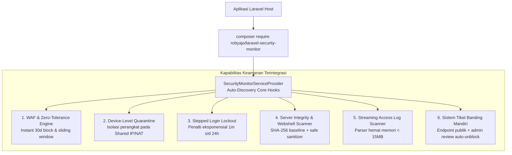

# Rencana & Kebutuhan Publikasi Packagist: `robyajo/laravel-security-monitor`

> **Dokumen Rencana Rilis Resmi**  
> **Paket**: `robyajo/laravel-security-monitor` (Bulwark)  
> **Status**: Siap Rilis (100% Decoupled Standalone Library, Pure PHP, Zero NPM)  
> **Target Lingkungan**: PHP `^8.2 | ^8.3 | ^8.4`, Laravel `^10.0 | ^11.0 | ^12.0 | ^13.0`  
> **Lisensi**: MIT

---

## Daftar Isi

1. [Fokus Tunggal: `laravel-security-monitor`](#1-fokus-tunggal-laravel-security-monitor)
2. [Status Kesiapan Repositori Saat Ini](#2-status-kesiapan-repositori-saat-ini)
3. [Arsitektur Terintegrasi & Dekopling Penuh](#3-arsitektur-terintegrasi--dekopling-penuh)
4. [Standar Desain Spatie (100% Pure PHP & Zero NPM)](#4-standar-desain-spatie-100-pure-php--zero-npm)
5. [Spesifikasi Metadata `composer.json`](#5-spesifikasi-metadata-composerjson)
6. [Kebutuhan Otomasi CI/CD (GitHub Actions)](#6-kebutuhan-otomasi-cicd-github-actions)
7. [Checklist Langkah Demi Langkah Menuju Packagist](#7-checklist-langkah-demi-langkah-menuju-packagist)
8. [Uji Verifikasi di Aplikasi Laravel Bersih (Smoke Test)](#8-uji-verifikasi-di-aplikasi-laravel-bersih-smoke-test)
9. [Gotcha Teknis & Best Practices Produksi](#9-gotcha-teknis--best-practices-produksi)
10. [Lampiran: Variabel Environment & Konfigurasi](#10-lampiran-variabel-environment--konfigurasi)

---

## 1. Fokus Tunggal: `laravel-security-monitor`

Berdasarkan evaluasi arsitektur final, strategi rilis **difokuskan 100% pada satu paket utama yang utuh**: **`robyajo/laravel-security-monitor`**.

---

## 2. Status Kesiapan Repositori Saat Ini

Repositori paket saat ini telah berdiri sendiri secara penuh di direktori paket:

| Komponen                        |     Status      | Catatan Verifikasi                                                                 |
| :------------------------------ | :-------------: | :--------------------------------------------------------------------------------- |
| **Pemisahan Kode (Decoupling)** | ✅ 100% Selesai | Seluruh referensi `App\` telah diubah ke `Internal\SecurityMonitor\`.              |
| **Model User Dinamis**          | ✅ 100% Selesai | Menggunakan `config('security.user_model')` + Trait `HasSecurityRelations`.        |
| **Nama Tabel Dinamis**          | ✅ 100% Selesai | Seluruh model membaca nama tabel dari `config('security.table_names.*')`.          |
| **Bebas Dependensi NPM**        | ✅ 100% Selesai | Murni Composer library (`type: library`), nol ketergantungan build tool frontend.  |
| **Uji Otomatis (Testing)**      | ✅ 100% Passed  | **64 passed (274 assertions)** menggunakan Pest PHP + Orchestra Testbench.         |
| **Dokumentasi Resmi**           | ✅ 100% Lengkap | 24 bab panduan di `documents/` + portal interaktif offline `documents/index.html`. |
| **Workflow CI/CD**              |     ✅ Siap     | Matrix pengujian GitHub Actions di `.github/workflows/run-tests.yml`.              |

---

## 3. Arsitektur Terintegrasi & Dekopling Penuh

Paket ini menggabungkan 6 kapabilitas keamanan enterprise dalam satu kesatuan arsitektur:



---

## 4. Standar Desain Spatie (100% Pure PHP & Zero NPM)

Paket ini mengikuti standar konvensi paket ekosistem Spatie (`spatie/laravel-permission`):

1. **Auto-Discovery Tanpa Konfigurasi Manual**:
   Laravel otomatis mendeteksi `SecurityMonitorServiceProvider` dan Facade `SecurityMonitor`.
2. **Satu Baris Trait Eloquent**:
   Pengguna cukup menambahkan `use HasSecurityRelations;` pada model `App\Models\User`.
3. **Core Event Listeners Otomatis**:
   Langsung mengawasi event inti `\Illuminate\Auth\Events\Failed` dan `Login`.
4. **Middleware Terisolasi**:
   Aliased `'security.block'`, `'security.detect'`, `'security.admin'`, `'security.activity'`.
5. **Universal & Frontend Agnostic**:
   Dapat diterapkan di proyek Blade murni, API backend headless, Livewire, Filament/Nova, atau Inertia.

---

## 5. Spesifikasi Metadata `composer.json`

Berkas `composer.json` telah dikonfigurasi untuk standar katalog Packagist:

```json
{
    "name": "robyajo/laravel-security-monitor",
    "description": "Enterprise-grade headless self-hosted WAF, threat detection engine, zero-tolerance blocking, stepped login lockout, and security auditing toolkit for Laravel.",
    "keywords": [
        "laravel",
        "security",
        "waf",
        "firewall",
        "threat-detection",
        "ip-blocking",
        "brute-force",
        "login-throttle",
        "webshell-scanner",
        "security-audit",
        "headless"
    ],
    "homepage": "https://github.com/robyajo/laravel-security-monitor",
    "support": {
        "issues": "https://github.com/robyajo/laravel-security-monitor/issues",
        "source": "https://github.com/robyajo/laravel-security-monitor",
        "docs": "https://github.com/robyajo/laravel-security-monitor#readme"
    },
    "type": "library",
    "license": "MIT",
    "authors": [
        {
            "name": "Roby",
            "email": "robyfull.dev@gmail.com",
            "role": "Developer"
        }
    ],
    "require": {
        "php": "^8.2|^8.3|^8.4",
        "illuminate/auth": "^10.0|^11.0|^12.0|^13.0",
        "illuminate/console": "^10.0|^11.0|^12.0|^13.0",
        "illuminate/database": "^10.0|^11.0|^12.0|^13.0",
        "illuminate/http": "^10.0|^11.0|^12.0|^13.0",
        "illuminate/routing": "^10.0|^11.0|^12.0|^13.0",
        "illuminate/support": "^10.0|^11.0|^12.0|^13.0",
        "illuminate/validation": "^10.0|^11.0|^12.0|^13.0"
    },
    "require-dev": {
        "mockery/mockery": "^1.6",
        "orchestra/testbench": "^8.0|^9.0|^10.0",
        "pestphp/pest": "^2.0|^3.0|^4.0",
        "pestphp/pest-plugin-laravel": "^2.0|^3.0|^4.0"
    },
    "autoload": {
        "psr-4": {
            "Internal\\SecurityMonitor\\": "src/"
        }
    },
    "autoload-dev": {
        "psr-4": {
            "Internal\\SecurityMonitor\\Tests\\": "tests/"
        }
    },
    "extra": {
        "laravel": {
            "providers": [
                "Internal\\SecurityMonitor\\SecurityMonitorServiceProvider"
            ],
            "aliases": {
                "SecurityMonitor": "Internal\\SecurityMonitor\\Facades\\SecurityMonitor"
            }
        }
    },
    "minimum-stability": "stable",
    "prefer-stable": true
}
```

---

## 6. Kebutuhan Otomasi CI/CD (GitHub Actions)

Berkas `.github/workflows/run-tests.yml` telah dipasang untuk menguji kompatibilitas silang secara otomatis pada setiap `push` dan `pull_request`:

- **Versi PHP**: `8.2`, `8.3`, `8.4`
- **Versi Laravel**: `10.*`, `11.*`, `12.*`, `13.*`
- **Harness**: `orchestra/testbench` (`8.*`, `9.*`, `10.*`)
- **Ekstensi Wajib**: `mbstring`, `pdo`, `sqlite`, `pdo_sqlite`, `filter`, `openssl`
- **Test Runner**: `./vendor/bin/pest --ci`

---

## 7. Checklist Langkah Demi Langkah Menuju Packagist

### Langkah 1: Inisialisasi & Push ke GitHub Publik

1. Buat repositori baru di GitHub: `https://github.com/robyajo/laravel-security-monitor`.
2. Pastikan visibility disetel **Public**.
3. Push seluruh berkas paket ke branch `main`:
    ```bash
    git remote add origin https://github.com/robyajo/laravel-security-monitor.git
    git branch -M main
    git push -u origin main
    ```

### Langkah 2: Berikan Tag Rilis Semantic Versioning (SemVer)

Packagist menentukan versi stabil dari Git Tag:

```bash
git tag -a v1.0.0 -m "Release v1.0.0: Enterprise-grade Headless WAF and Security Monitor for Laravel"
git push origin v1.0.0
```

### Langkah 3: Daftarkan di Packagist.org

1. Buka [https://packagist.org/packages/submit](https://packagist.org/packages/submit) dan login menggunakan akun GitHub Anda.
2. Masukkan URL repositori:
   `https://github.com/robyajo/laravel-security-monitor`
3. Klik **Check**, lalu klik **Submit**.
4. Paket akan terdaftar dengan nama **`robyajo/laravel-security-monitor`**.

### Langkah 4: Aktifkan GitHub Webhook Otomatis

Agar setiap kali Anda melakukan push atau membuat tag baru paket di Packagist otomatis ter-update:

1. Buka menu pengaturan repositori di GitHub: **Settings** → **Webhooks** → **Add webhook**.
2. Masukkan Payload URL dari Packagist:
   `https://packagist.org/api/github?username=robyajo`
3. Pilih Secret sesuai API token Packagist Anda.
4. Pilih event: **Just the push event** → **Active** → **Add webhook**.

---

## 8. Uji Verifikasi di Aplikasi Laravel Bersih (Smoke Test)

Sebelum mengumumkan rilis ke publik, lakukan uji coba instalasi pada proyek Laravel baru:

```bash
# 1. Buat aplikasi Laravel bersih
composer create-project laravel/laravel test-security-app
cd test-security-app

# 2. Pasang paket dari Packagist
composer require robyajo/laravel-security-monitor

# 3. Jalankan instalasi aset
php artisan security:install

# 4. Jalankan migrasi
php artisan migrate

# 5. Uji perintah Artisan
php artisan security:baseline
php artisan security:scan-logs --dry-run
```

---

## 9. Gotcha Teknis & Best Practices Produksi

1. **ReDoS Safety Guarantee**:
   Signature regex wajib diuji melalui `Tests\Feature\DetectorTuningTest`. Dilarang keras menggunakan kuantifier bersarang seperti `(a+)+` atau `(.*[a-z])+`.
2. **Reverse Proxy Trust**:
   Aplikasi konsumen wajib menyetel `trustProxies` di Laravel jika berada di balik Cloudflare agar `CF-Connecting-IP` tidak dipalsukan.
3. **Safe File Sanitizer**:
   Pembersih berkas berbahaya dibatasi strictly di dalam `base_path()` dan tidak dapat menghapus berkas vital (`.env`, `composer.json`, `public/index.php`).
4. **Memory-Safe Streaming Scanner**:
   Log web server dibaca baris-per-baris dengan generator `yield` sehingga konsumsi RAM stabil < 15MB.

---

## 10. Lampiran: Variabel Environment & Konfigurasi

Daftar lengkap variabel `.env` yang dapat disetel di aplikasi host:

| Variabel `.env`                   |        Default         | Deskripsi                                     |
| :-------------------------------- | :--------------------: | :-------------------------------------------- |
| `SECURITY_MONITOR_ENABLED`        |         `true`         | Sakelar utama WAF                             |
| `SECURITY_BLOCK_ENFORCEMENT`      |         `true`         | Penolakan HTTP 403 untuk IP terblokir         |
| `SECURITY_AUTO_BLOCK_ENABLED`     |         `true`         | Auto-block akumulasi ancaman berulang         |
| `SECURITY_AUTO_BLOCK_THRESHOLD`   |          `3`           | Ambang batas kejadian (default: 3 kali)       |
| `SECURITY_AUTO_BLOCK_WINDOW`      |          `10`          | Jendela evaluasi waktu (menit)                |
| `SECURITY_AUTO_BLOCK_DURATION`    |          `24`          | Durasi auto-block (jam)                       |
| `SECURITY_INSTANT_BLOCK_ENABLED`  |         `true`         | Blokir instan pada percobaan pertama untuk ZT |
| `SECURITY_INSTANT_BLOCK_DURATION` |         `720`          | Durasi blokir instan (jam; 720 jam = 30 hari) |
| `SECURITY_LOGIN_LOCKOUT_ENABLED`  |         `true`         | Proteksi brute force bertingkat (1m - 24h)    |
| `SECURITY_LOG_RETENTION_DAYS`     |          `90`          | Masa retensi log (hari)                       |
| `SECURITY_SCHEDULE_ENABLED`       |         `true`         | Otomasi tugas scheduler (prune & heartbeat)   |
| `SECURITY_SUPPORT_EMAIL`          | `security@example.com` | Email helpdesk di halaman penolakan 403       |
